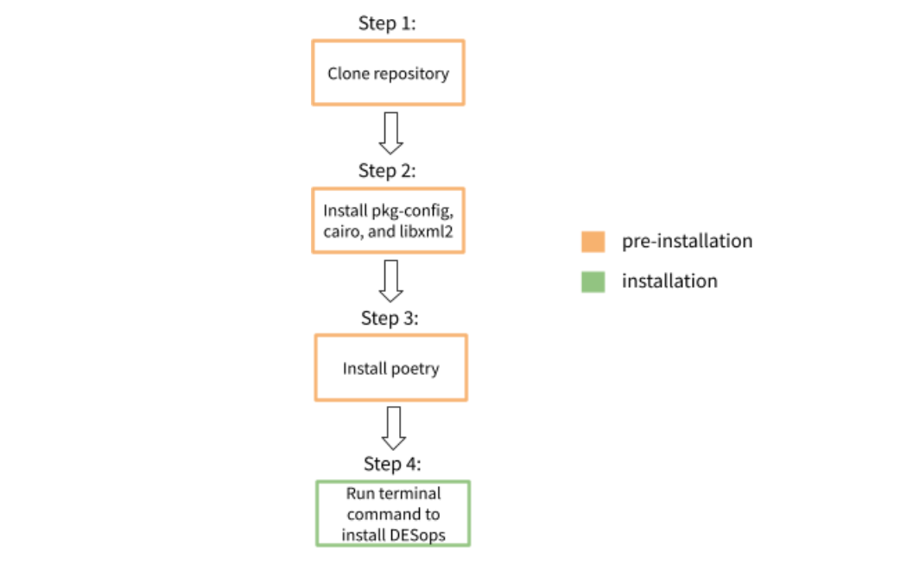
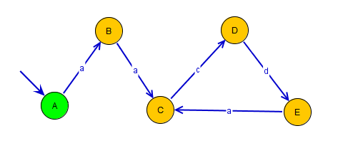

This package provides a convenient way of handling Discrete Event System models as
finite state automata. Additionally, some useful functions and operations on automata have been
implemented, including parallel/product compositions and observer computation. The goal is to provide a simple way to combine these operations in a modular environment, with the usability of Python which makes extending the functionalities provided here very straightforward.

## Installation

Below is a diagram that showcases the installation process. Before installing DESops, the first three steps must be completed first.  



### Step 1: Clone Repository

On the right hand corner of this page, click on the blue box that says `Clone`. Copy and paste the HTTPS url. 

In your working directory, write the following command:

    $ git clone https://gitlab.eecs.umich.edu/M-DES-tools/desops.git

After running this command, a copy of this repository will be available in your working directory. 

### Step 2: Install pkg-config, cairo, and libxml2

These packages are dependencies required to install `pycairo`. This is key for the later installation of `python-igraph`, which DESops uses to plot graphs.

Both `pkg-config` and `cairo` can be installed at once. Depending on your operating system, you can follow the steps on this [website](https://pycairo.readthedocs.io/en/latest/getting_started.html) to properly install these dependencies. Do **NOT** install pycairo yet. This will be done in step 4.

### Step 3: Install Poetry:

You can use `pip` to properly install `poetry`. Run the following command:

    $ pip install --user poetry

### Common Error: Operating device does not recognize pip

Sometimes pip requires a different command depending on your operating system. If the command above did not work, try the following alternatives:

    $ python3 -m pip install --user poetry
or

    $ python -m pip install --user poetry

Different installation methods are available on the [poetry](https://python-poetry.org/) website if needed.

### Step 4: Install DESops:

Make sure you are in the same working directory as the `poetry.lock` file. This should be located where you cloned the repository.

DESops can be installed using [poetry](https://python-poetry.org/) and running the command:

    $ poetry install

pycairo is used by `python-igraph` for plotting Graphs. `DESops` uses these methods for plotting as well.
To use the `DESops.plot` submodule, install with pycairo as well:

    $ poetry install -E pycairo

### Common Error: Pycairo not recognized

If poetry **does not** recognize pycairo as an optional dependency, try running these two commands:

    $ poetry remove pycairo

Removes pycairo from the list of dependencies.

    $ poetry add "pycairo==1.11.1"

Note that version 1.11.1 of pycairo was specified due to issues with pycairo's current version 1.20
### Note for Windows Users:

When using Windows, pycairo needs to be built from the wheel. Download one of the "cp38" versions located here:
https://www.lfd.uci.edu/~gohlke/pythonlibs/#pycairo

Then install using `pip install <path_to>\pycairo‑1.19.1‑cp38‑cp38‑<win_version>.whl`


### Manual Installation:

Download/clone the DESops repository. The following dependencies must also be installed:

* `python-igraph` (at least version `0.8.0`) must be installed. The installation process may be slightly more involved than simply using `pip`. Their [website](https://igraph.org/python/) has more information on how to install.
* `pycairo` is required by `igraph` to handle plotting & visualization. Only required if using `plot()` method.

* If unable to install `pycairo` with poetry, the two dependenices needed are `cairo` and `pkg-config`. The installation procedure for these packages require more than running `pip`. This [website](https://pycairo.readthedocs.io/en/latest/getting_started.html) specifies which command you should write depending on your operating system.

* `pydash` (version `4.7.6`), `requests` (version `2.24.0`), `dd` (version `0.5.5`), `tqdm` (version `4.46.1`), `colorama` (version `0.4.3`)


#### Random Automata Generation

Generating random automata using the `random_DFA` submodule requires the REGAL software package, with source code bundled in this repository.
The following is only relevant for using the `random_DFA` submodule.
(link to DESops/random_DFA/regal-1.08.0929/COPYING) Some of the files in the library have been modified, so an external installation of the software won't work.

There are detailed instructions for compiling the source code in the file `random_DFA/regal-1.08.0929/regal_readme.txt`
There are several required libraries, and a c++ compiler is needed to build the REGAL executables. The script `build.py` (only for Linux systems with a g++ compiler) automates the build process after the preqrequisite libraries are installed.


## Automata Classes
Automata are stored as class instances DFA, NFA and PFA. The Python library igraph is used to store the graphs. igraph's core is imlemented in C, so large networks can be stored efficiently.

There are multiple methods for interfacing automata and Automata objects, including reading/writing to `.fsm` filetypes, used in the DESUMA software package, as well as reading/writing from igraph Graphs. The igraph library has further functions to convert between Graphs and various graph file types (see the igraph documentation for more details).

A key feature of the igraph library is the ability to have attributes stored for individual edges and vertices. This functionality is used to track names of vertices, labels of events on transitions (edges) and probability of transitions.


## Usage

This section provides a brief overview with using the Automata class, as well as highlighting some of its useful functionalities.

The package is imported to a Python module/script or interpreter as follows:

    >>> import DESops as d

### Creating Automata

Automata can be initialized directly from `.fsm` files:

    >>> A = d.DFA('A.fsm')
    >>> B = d.DFA('B.fsm')

It's also possible to initialize from an igraph Graph:

    >>> G = igraph.Graph(directed=True)
    >>> C = d.DFA(G)

In a similar manner, Automata can be initialized from other Automata:

    >>> G = d.DFA()
    >>> G_copy = d.DFA(G)

Finally, Automata can be created from scratch within Python by individually adding edges and vertices. The Automata class has the methods `add_vertex()`, `add_vertices()`, `add_edge()`, and `add_edges()`, which call igraph Graph methods by the same. See the igraph documentation for further details on using these functions.

For example, consider constructing the following automaton:



This automaton has 5 vertices and 5 transitions, which can be added with the `add_*()` methods.

    >>> E = d.DFA()
    >>> E.add_vertices(5) # Add 5 unnamed vertices to E
    >>> E.add_edge(0, 1, 'a') # Add transition from vertex 0 to 1, with label 'a'
    >>> E.add_edges([(1,2),(2,3),(3,4),(4,2)], labels=['a','c','d','a']) # parallel lists for edge pairs and labels

`add_edges` also supports other edge attributes, which can be provided as keyword arguments:

    >>> B.add_edges([(1,2)], labels=['a'], my_edge_attr=['c'])
    >>> ['c'] == B.es["my_edge_attr"]

Vertices and Edges can be named/labelled after their creation by accessing the "name"/"label" attribute in the `VertexSeq`/`EdgeSeq` dict:

    >>> E.vs["name"] = ['A','B','C','D','E']

Note that the this process cannot be used to update individual entries. For example, the following code will NOT change the name of vertex 'E':

    >>> G.vs["name"][4] = 'F' # WILL NOT MODIFY THE VERTEX NAME

Instead, the `update_attributes()` method must be used to modify specific edge or vertex attributes. These are igraph Graph Edge and Vertex methods. For details on these methods, see the
igraph Edge and Vertex class documentations.

    >>> d = {"name" : 'F'}
    >>> G.vs[4].update_attributes(d) # Name of vertex 4 is now 'F'
    >>> G.es[0].update_attributes({"label" : 'b'}) # Change edge 0 label from 'a' to 'b'


#### DFA notes
If the automata is a DFA instance, `add_edges` and initializing from an existing structure will by default check for determinism, unless `check_DFA` is set to false

    >>> G = d.DFA(A, check_DFA=False)
    >>> G.add_edges([(1,2), (1,3)], ['a', 'a'], check_DFA=False) # Won't raise an error, but this is not a DFA

### Operations on Automata
A and B now contain the Automata representations of 'A.fsm' and 'B.fsm'. To compute the parallel composition of A and B:

    >>> AparB = d.parallel_comp([A, B])
    >>> AprodB = d.product_comp([A, B])

The input for these compositions is a list to accomdate more than two inputs. See the `parallel_comp` documentation for more details.

    >>> ABC = d.parallel_comp([A, B, C]) # Computes A || B || C


### Supervisory Control Methods
Several methods have been implemented for solving supervisory control problems. For example, the supremal controllable and normal sublanguage (automata realization)
can be computed using the `supervisor` submodule:

    >>> sup = d.supervisor.supremal_sublanguage(plant, spec, mode=Mode.CONTROLLABLE_NORMAL, preprocess=True)

Setting the preprocess argument to True (default behavior) will compute modified `plant` and `spec` automata such that the `spec` is a subautomata of the `plant`,
and the `plant` is a space partitioned automata (SPA).


### Visualization
Automata can also be visualized via the `plot()` or `write_svg()` methods, which are extensions of the igraph Graph methods by the same names. igraph uses the Cairo library for plotting. As such, Cairo is required for plotting in the Automata class.

### igraph interactions
Generally, the Automata class should have methods defined for most common uses. In some cases however, there may be desired methods which have already been implemented in the igraph Graph class. In these times where a binding is not already included in the Automata class interface, the underlying Graph instance should be accessed via the `_graph` member of Automata instances.

For example, there is no method in the Automata class for finding the degree of a network. However, igraph's Graph has a degree method, which can be used as follows:

    >>> A._graph.degree(1)


### Denoting initial state:
The initial state of an automaton is assumed to always be the first element in an igraph `VertexSeq`. For NFAs, initial state information is stored in a vertex attribute "init"

    >>> i = A.vs[0] # i should always be the initial state
    >>> is_init_state = A_NFA.vs["init"][3] # returns bool: if state 3 is an initial stat

### Datatypes of members:
* The sets of uncontrollable and unobservable events should always be `set()` instances, as well as the set of critical states (`Euc`, `Euo`, `X_crit`).

* Vertex names (`VertexSeq` attribute `"name"`) can be any object. When converting to `fsm` or plotting, the names might appear strange if this object doesn't have a simple `str()` casting.

* Edge labels (`EdgeSeq` attribute `"label`") should ALWAYS be Event objects. Event objects have a label method, which can store any object (for best results plotting, this object should have
a simple `str()` casting).


### Other notes:
* The supremal controllable supervisor operations have specified conditions on the Automata instances used; make sure assumptions are satisfied, or use the functions that handle preprocessing.

* Serialization is neatly handled by the igraph `write_pickle()` and `read_pickle()` methods. See the igraph documentation for more details, but they can be used as Automata methods with no issues.

## Contributing to DESops

You will need [Poetry](https://python-poetry.org/) to start contribution on the DESops codes.

First, you will need to clone the repository using `git`:
```
$ git clone git@gitlab.eecs.umich.edu:M-DES-tools/desops.git
$ cd desops
```

Second, you will need to install the required dependencies and `pre-commit` git hooks:
```
$ poetry install
$ poetry run pre-commit install
```

### Before pushing your contribution to the repository

`pre-commit` checks the code style and fix it if necessary every time the code
changes are committed. When `pre-commit` fixes the code style, `git` automatically
reverts your `commit` command, so you will need to stage your changes again.

This repository employs [pytest](https://docs.pytest.org/en/latest/) to write tests.
All tests are located in `tests` directory, and must be written with the formats of
`pytest`.

You can execute tests by the following command:
```
$ poetry run pytest
```
You can also execute certain tests by specifying test names:
```
$ poetry run pytest -k [name]
```
For example, if you want to do the test defined by `def test_example():`, pass its name to `pytest` as:
```
$ poetry run pytest -k example
```

For other options of `pytest`, see `poetry run pytest --help`.
